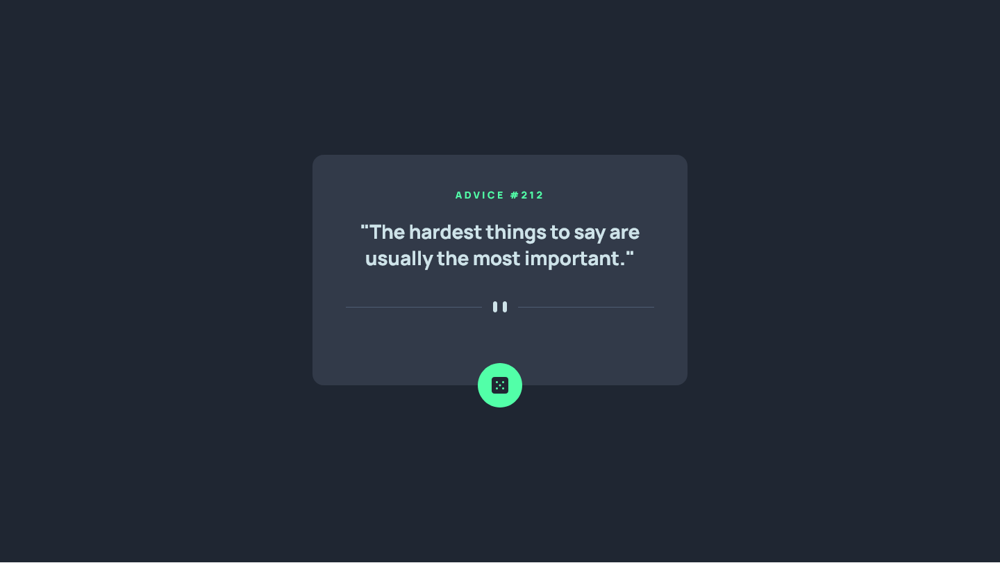

# Frontend Mentor - Advice generator app solution

This is a solution to the [Advice generator app challenge on Frontend Mentor](https://www.frontendmentor.io/challenges/advice-generator-app-QdUG-13db). Frontend Mentor challenges help you improve your coding skills by building realistic projects.

## Table of contents

- [Overview](#overview)
  - [The challenge](#the-challenge)
  - [Screenshot](#screenshot)
  - [Links](#links)
- [My process](#my-process)
  - [Built with](#built-with)
  - [What I learned](#what-i-learned)
  - [Useful resources](#useful-resources)
- [Author](#author)

## Overview

### The challenge

Users should be able to:

- View the optimal layout for the app depending on their device's screen size
- See hover states for all interactive elements on the page
- Generate a new piece of advice by clicking the dice icon

### Screenshot

### Links

- [Solution](https://www.frontendmentor.io/solutions/advice-generator-solution-built-with-react-MZcGty-U2w)
- [Live Site](https://unique-zuccutto-b3b2df.netlify.app/)

## My process

### Built with

- Semantic HTML5 markup
- CSS custom properties
- Flexbox
- CSS Grid
- Mobile-first workflow
- [React](https://reactjs.org/) - JS library

### What I learned

With this challenge I got better acquainted with axios and fetching from APIs in general.

### Useful resources

- [Axios' Documentation](https://axios-http.com/docs/api_intro)

## Author

- Frontend Mentor - [@fernandoLRibeiro](https://www.frontendmentor.io/profile/fernandoLRibeiro)
